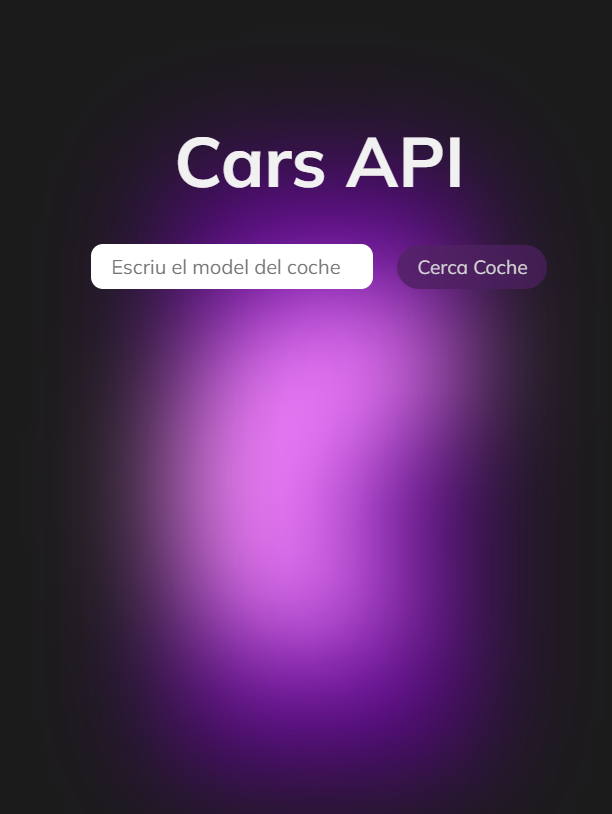
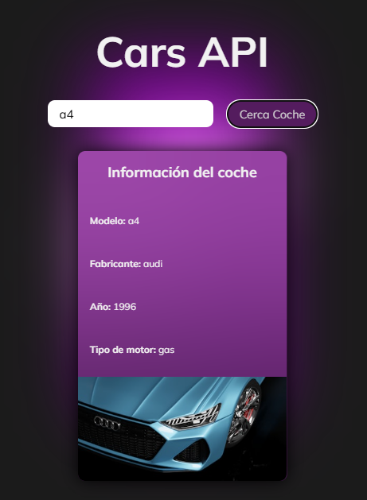

# Cars API Demo

Este proyecto es una demostración de cómo utilizar API's para obtener 
información y actualizarla en el html y mostrarla por pantalla.

## Archivos

- **index.html**: Contiene la estructura básica de la página web.
- **styles.css**: Contiene los estilos para la página web.
- **script.js**: Contiene el código JavaScript para interactuar con las 2 APIs y actualizar la página web.

## APIs utilizadas

- [API de coches](https://api.api-ninjas.com/v1/cars)
- [API de Unsplash](https://unsplash.com/developers)

## Estilos

La fuente utilizada es [Mulish](https://fonts.google.com/specimen/Mulish). 
También he practicado css incluyendo una forma svg con blur y cambio de color.

### Captura de pantalla

    
    

